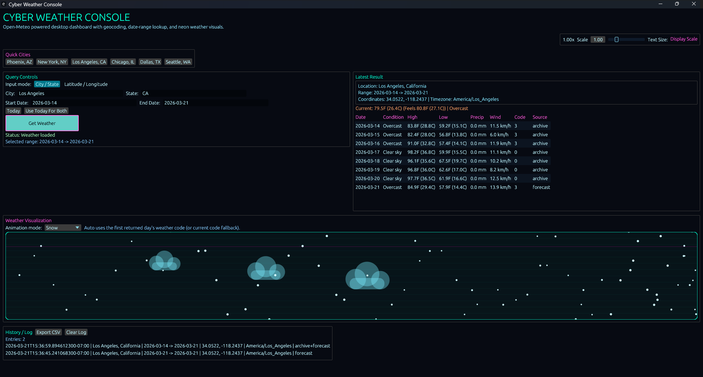

# Cyber Weather Console

A futuristic Rust desktop weather app that turns checking the forecast into something a lot more fun.

Instead of a boring plain weather screen, this app gives you a sleek cyber-style interface where you can look up weather by city and state or by latitude and longitude, choose a custom date range, and watch the app respond with animated weather visuals that match the conditions.

The desktop app uses the **Open-Meteo API** to fetch real weather data from the internet, so the information shown in the app comes from live online weather services rather than hardcoded example data.

It is part practical tool, part programming project, and part visual experience.

## Screenshot



---

## What This App Does

Cyber Weather Console lets you:

- search weather by **city and state**
- search weather by **latitude and longitude**
- choose a **custom date range**
- quickly fill in **today’s date**
- use **preset city buttons** for faster testing
- view weather results in a clean desktop GUI
- enjoy **animated weather effects** based on the forecast
- save a local history of your searches
- export your weather history to CSV

This means you are not limited to just “what’s the weather right now.” You can also explore weather across a span of dates, making the app more useful for learning, comparing, and experimenting.

---

## Why This App Is Cool

Most beginner weather apps stop at displaying text on a screen.

This one goes further.

It combines real weather data from the internet with a futuristic interface and animated visual feedback, so the app feels alive. When the weather changes, the mood of the application changes with it. That makes it more interesting to use, more fun to show off, and more memorable than a basic forecast tool.

What makes it stand out:

- **Cyber-themed interface** that looks more like a sci-fi dashboard than a plain utility
- **Live weather data** fetched from the internet using the Open-Meteo API
- **Animated weather scenes** that visually reflect sunny, rainy, snowy, or cloudy conditions
- **Flexible search options** so users can type a location naturally or enter exact coordinates
- **Date-range support** so it is more than just a “current weather” app
- **History and export tools** that make it useful beyond a one-time lookup
- built in **Rust**, which makes it an impressive project for learning modern systems programming and GUI development

In other words, this is the kind of app that is both useful and fun to demo.

---

## Who This App Is For

This project is great for:

- people who want a nicer way to explore weather data
- Rust learners who want to study a real GUI application
- developers looking for an example of API integration in Rust
- anyone who wants a small desktop app that feels modern and visually interesting
- content creators who want a project that is more exciting to explain than a simple console app

---

## How It Works

The app takes the location you enter and fetches weather data from the internet using the **Open-Meteo API**.

If you type a city and state, the app first converts that into coordinates behind the scenes. Then it uses those coordinates to request weather data for the dates you selected.

The result is shown in a desktop interface with a themed visual design and weather-based animation, making the whole experience feel more interactive than a standard weather checker.

---

## Features

- Futuristic cyber-style desktop GUI
- Fetches live weather data from the internet using the Open-Meteo API
- Search by city and state
- Search by latitude and longitude
- Start date and end date input
- Today button for quick entry
- Quick-select city buttons
- Animated weather display
- Local search history
- CSV export
- Adjustable interface scaling for readability

---

## Why It’s a Good Project

Cyber Weather Console is a strong project because it combines several useful ideas in one application:

- desktop GUI development
- internet API requests
- date handling
- user input processing
- animated visual feedback
- local file saving
- export functionality

So even though it looks stylish on the outside, it also teaches a lot under the hood.

This makes it a good portfolio project, a good learning project, and a good app to build on later.

---

## Built With

- **Rust**
- **eframe / egui**
- **reqwest**
- **serde**
- **chrono**
- **csv**

---

## Getting Started

### Clone the Repository

```bash
git clone https://github.com/your-username/cyber-weather-console.git
cd cyber-weather-console
```

Run the App
```bash
cargo build

cargo run
```

### Example Uses

You can use this app to: 

- check weather in your area

- compare weather across multiple days

- explore weather in different cities

- test coordinates directly

- save and export lookup history

- demonstrate a polished Rust GUI project

### License

MIT License